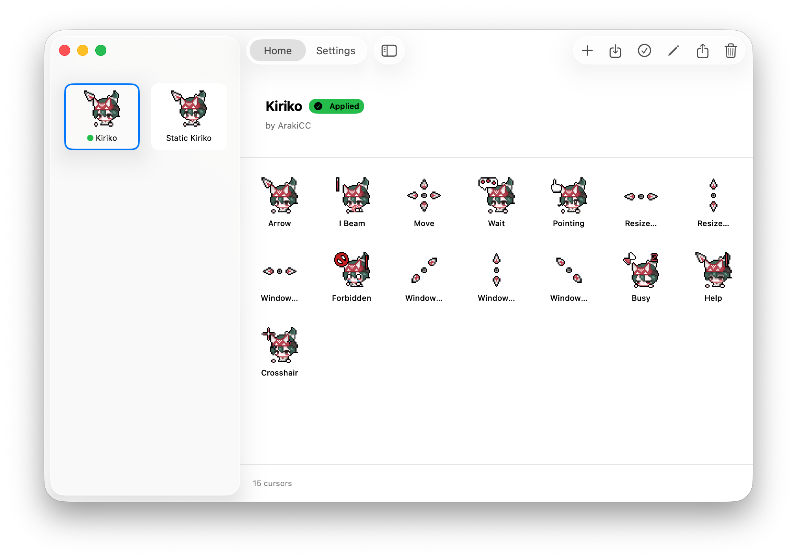
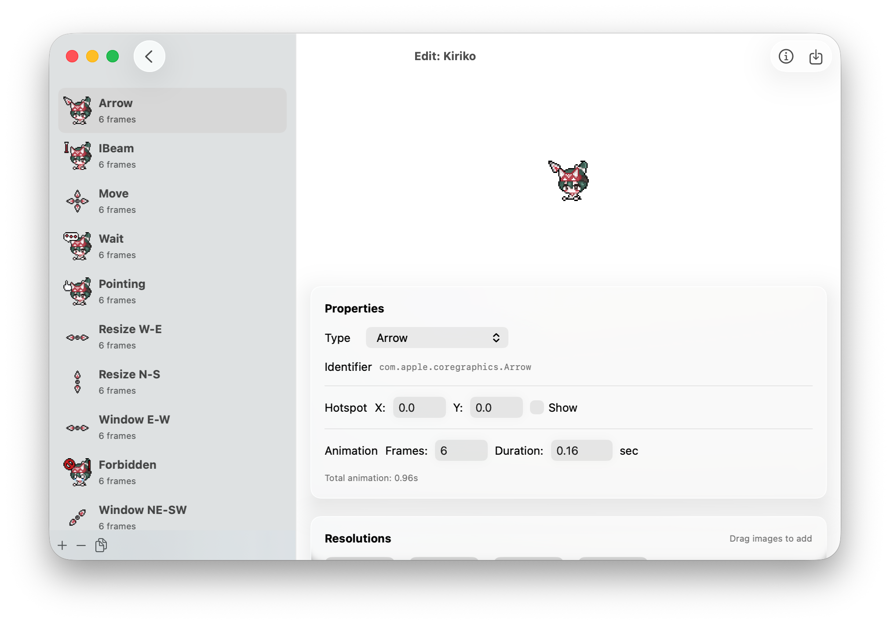
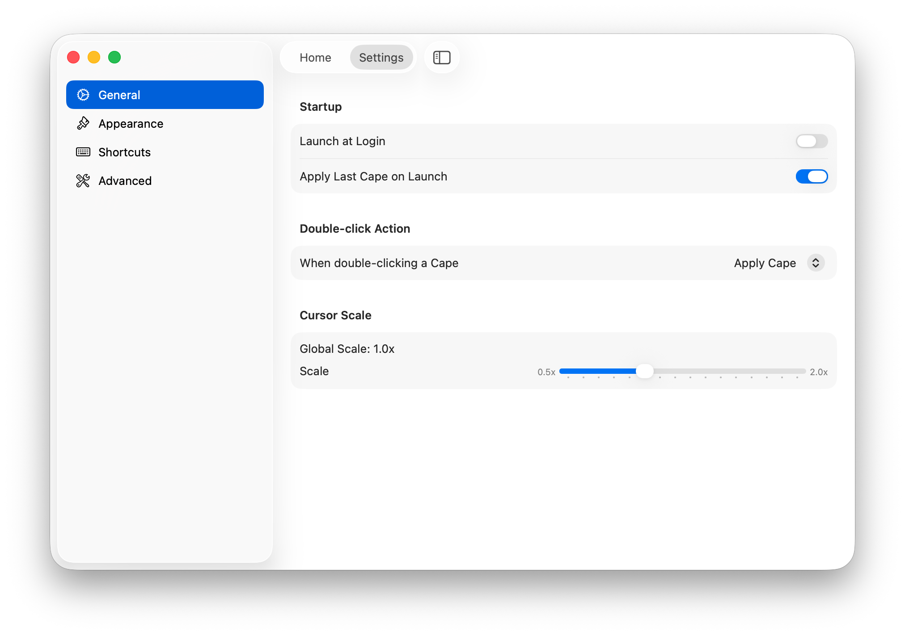

Mousecape
===

**[English](#english) | [中文](#中文说明)**

<a id="english"></a>

A free cursor manager for macOS Tahoe (26)+ built using private, nonintrusive CoreGraphics APIs.

> **Note:** The new UI based on SwiftUI is under development. You can switch to the `TahoeSupport` branch to build it yourself.





## How it works

Mousecape works by calling the API calls that Apple uses to initialize the system cursors in the system and it registers a daemon that will automatically apply the cursor on login and when cursors get unregistered.

It is unintrusive and works in the background. You just need to open the app, click **Mousecape --> Install Helper Tool**, apply your cursor and you're done!

## Troubleshooting

### Helper Tool Not Running

If you previously installed an older version of Mousecape, you may need to unregister the old helper before installing the new one.

**Check helper status:**
```bash
launchctl list | grep mouse
```

**Expected output (running normally):**
```
12345   0   com.alexzielenski.mousecloakhelper
```
- First column: PID (process ID)
- Second column: Exit code (`0` = running normally, `78` = configuration error)

**If the helper shows exit code 78 or is not running:**

1. Unregister the old helper:
   ```bash
   launchctl bootout gui/$(id -u)/com.alexzielenski.mousecloakhelper
   ```

2. Wait a moment, then verify it's removed:
   ```bash
   launchctl list | grep mouse
   ```

3. Open Mousecape and click **Mousecape --> Install Helper Tool**

4. Verify the helper is running:
   ```bash
   launchctl list | grep mouse
   ```

### Removing Mousecape from Login Items

After uninstalling, Mousecape may still appear in **System Settings --> General --> Login Items & Extensions**. This is normal macOS behavior - the system keeps records until:
- The app is completely deleted from your system, or
- You manually remove it from Login Items settings

## Where do I get cursors?

A pack of cursors in Mousecape is called a cape, each cape contains a multiple scales of representations of many cursors. For example, the Arrow cursor can have 1x, 2x, 5x, and 10x representations while the Wait cursor can have 1x, and 2x. 

There is an example cape file included in this Git Repo located [here for download](https://github.com/alexzielenski/Mousecape/blob/master/Mousecape/com.maxrudberg.svanslosbluehazard.cape). It is a remake of [Max Rudberg's](http://maxrudberg.com/) loved Svanslös cursors generously crafted by Max for us to use. Simply double click the cape file with Mousecape on your system and it will be imported into your library.

## How can I create my own cape?

You can create a new cape document in the Mousecape app by hitting &#8984;N (Command-N) and editing it with &#8984;E. Click the "+" button to add cursors to customize and symply drag your images into the fields provided.

## How do animated cursors work?

When you want to animate a cursor, change the value in the frames field in the edit window and make sure frame duration is how you want it. Next, create an image that has all of your cursor frames stacked on top of each other vertically. Mousecape will traverse down the image for each frame, using a box the same size as whatever you put in the size field.

## How can I say thanks?

Tell your friends.

## Where can I get a copy of this sweet tool?

In the [releases section](https://github.com/sdmj76/Mousecape/releases) of this GitHub page.

## There's now the beginning of a wiki

Look for the wiki symbol in the toolbar here on this GitHub page or through here [wiki section](https://github.com/alexzielenski/Mousecape/wiki)

## LICENSE

I worked very hard researching the private methods used in Mousecape and creating this app. Please respect me and my work by not using any of the information provided here for commercial purposes.

Copyright (c) 2013-2025, Alex Zielenski
All rights reserved.

Redistribution and use in source and binary forms, with or without modification, are permitted provided that the following conditions are met:

* Redistributions of source code must retain the above copyright notice, this list of conditions and the following disclaimer.
* Redistributions in binary form must reproduce the above copyright notice, this list of conditions and the following disclaimer in the documentation and/or other materials provided with the distribution.
* Any redistribution, use, or modification is done solely for personal benefit and not for any commercial purpose or for monetary gain

THIS SOFTWARE IS PROVIDED BY THE COPYRIGHT HOLDERS AND CONTRIBUTORS "AS IS" AND ANY EXPRESS OR IMPLIED WARRANTIES, INCLUDING, BUT NOT LIMITED TO, THE IMPLIED WARRANTIES OF MERCHANTABILITY AND FITNESS FOR A PARTICULAR PURPOSE ARE DISCLAIMED. IN NO EVENT SHALL THE COPYRIGHT HOLDER OR CONTRIBUTORS BE LIABLE FOR ANY DIRECT, INDIRECT, INCIDENTAL, SPECIAL, EXEMPLARY, OR CONSEQUENTIAL DAMAGES (INCLUDING, BUT NOT LIMITED TO, PROCUREMENT OF SUBSTITUTE GOODS OR SERVICES; LOSS OF USE, DATA, OR PROFITS; OR BUSINESS INTERRUPTION) HOWEVER CAUSED AND ON ANY THEORY OF LIABILITY, WHETHER IN CONTRACT, STRICT LIABILITY, OR TORT (INCLUDING NEGLIGENCE OR OTHERWISE) ARISING IN ANY WAY OUT OF THE USE OF THIS SOFTWARE, EVEN IF ADVISED OF THE POSSIBILITY OF SUCH DAMAGE.

---

# 中文说明

Mousecape
===

一款免费的 macOS Tahoe (26)+ 光标管理器，使用私有、非侵入式的 CoreGraphics API 构建。

> **提示：** 新 UI 基于 swiftUI 正在开发中，可切换至 `TahoeSupport` 分支自行构建。


## 工作原理

Mousecape 通过调用 Apple 用于初始化系统光标的 API 来工作，并注册一个守护进程，在登录时和光标被取消注册时自动应用光标。

它在后台静默运行，不会干扰系统。你只需要打开应用，点击 **Mousecape --> Install Helper Tool**，应用你的光标主题即可！

## 故障排除

### 守护进程未运行

如果你之前安装过旧版本的 Mousecape，可能需要先注销旧的守护进程，然后再安装新版本。

**检查守护进程状态：**
```bash
launchctl list | grep mouse
```

**正常运行时的输出：**
```
12345   0   com.alexzielenski.mousecloakhelper
```
- 第一列：PID（进程 ID）
- 第二列：退出码（`0` = 正常运行，`78` = 配置错误）

**如果守护进程显示退出码 78 或未运行：**

1. 注销旧的守护进程：
   ```bash
   launchctl bootout gui/$(id -u)/com.alexzielenski.mousecloakhelper
   ```

2. 等待片刻，验证是否已移除：
   ```bash
   launchctl list | grep mouse
   ```

3. 打开 Mousecape，点击 **Mousecape --> Install Helper Tool**

4. 验证守护进程是否正在运行：
   ```bash
   launchctl list | grep mouse
   ```

### 从登录项中移除 Mousecape

卸载后，Mousecape 可能仍会出现在 **系统设置 --> 通用 --> 登录项与扩展** 中。这是正常的 macOS 行为——系统会保留记录，直到：
- 应用从系统中完全删除，或
- 你手动从登录项设置中移除

## 在哪里获取光标主题？

Mousecape 中的光标包称为 cape，每个 cape 包含多个光标的多种缩放比例表示。例如，箭头光标可以有 1x、2x、5x 和 10x 表示，而等待光标可以有 1x 和 2x 表示。

本 Git 仓库中包含一个示例 cape 文件，可在[此处下载](https://github.com/alexzielenski/Mousecape/blob/master/Mousecape/com.maxrudberg.svanslosbluehazard.cape)。这是 [Max Rudberg](http://maxrudberg.com/) 深受喜爱的 Svanslös 光标的重制版，由 Max 慷慨制作供我们使用。只需在安装了 Mousecape 的系统上双击 cape 文件，它就会被导入到你的库中。

## 如何创建自己的 cape？

你可以在 Mousecape 应用中按 ⌘N (Command-N) 创建新的 cape 文档，然后按 ⌘E 进行编辑。点击 "+" 按钮添加要自定义的光标，然后将你的图片拖放到提供的字段中。

## 动画光标如何工作？

当你想制作动画光标时，在编辑窗口中更改帧数字段的值，并确保帧持续时间符合你的要求。接下来，创建一个将所有光标帧垂直堆叠在一起的图片。Mousecape 会从上到下遍历图片的每一帧，使用与你在尺寸字段中设置的相同大小的框。

## 如何表示感谢？

告诉你的朋友们。

## 在哪里获取这个工具？

在本 GitHub 页面的 [releases 部分](https://github.com/sdmj76/Mousecape/releases)。

## Wiki

在本 GitHub 页面的工具栏中找到 wiki 图标，或通过 [wiki 部分](https://github.com/alexzielenski/Mousecape/wiki) 访问。

