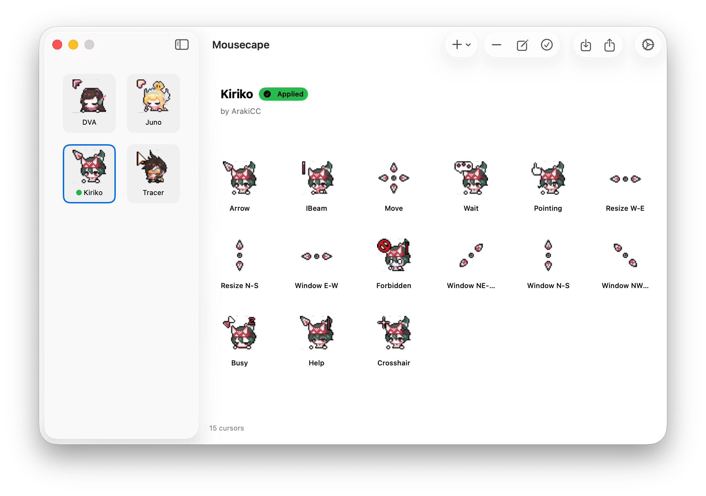
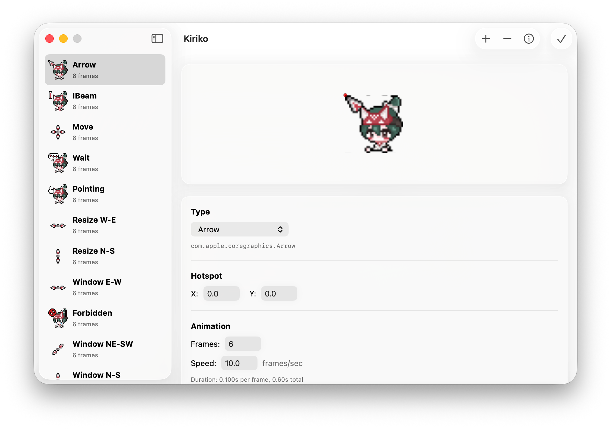
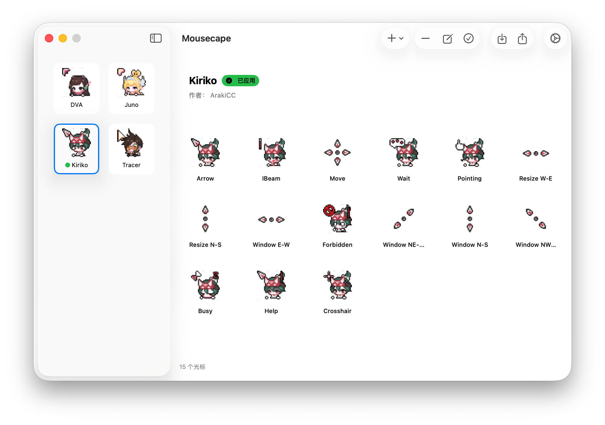
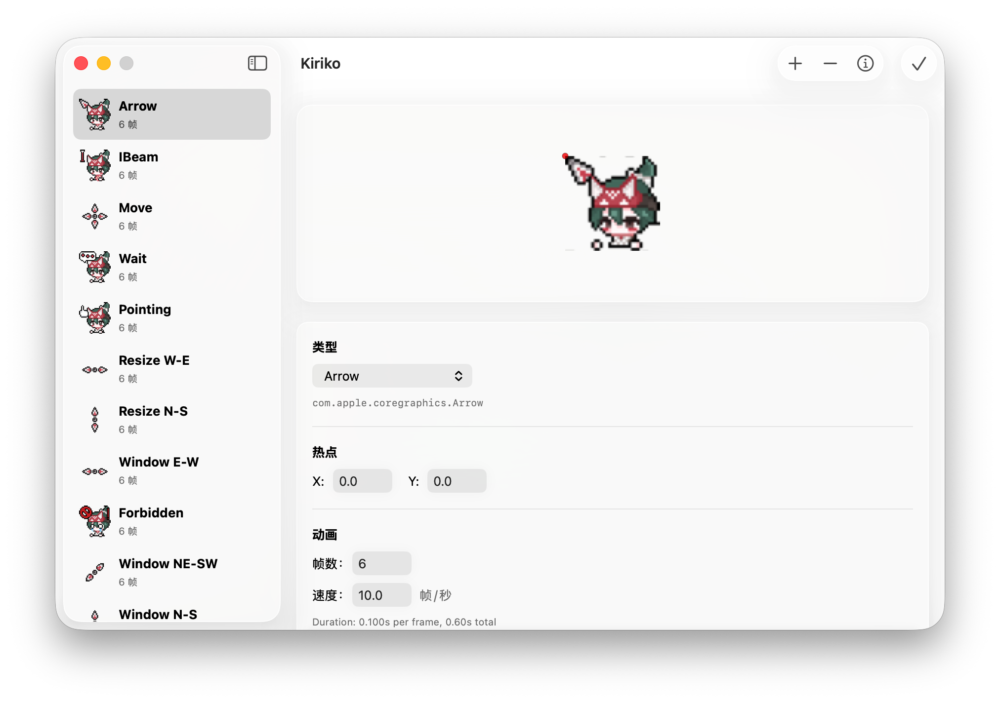

# Mousecape-swiftUI

**[English](#english) | [中文](#中文)**

---

<a id="english"></a>
## English

A free macOS cursor manager that allows you to easily replace Mac system pointers.

Built with SwiftUI, fully adapted to Liquid Glass design language, with complete support for macOS Tahoe.

**System Requirements: macOS Sequoia (15) or later**




> The cursor theme "Kiriko" shown in the screenshots is created by [ArakiCC](https://space.bilibili.com/14913641), available in the example files.

## Features

- Customize Mac system cursors, supporting both static and animated cursors
- One-click import of Windows cursor formats (.cur / .ani)

> Requires downloading the **premium** version, provided for free. The difference from the standard version is the built-in Python library for cursor conversion.

- Uses private, non-intrusive CoreGraphics API, safe and reliable
- Runs silently in the background without interfering with the system

## Download & Installation

Download the latest version from the [Releases](https://github.com/sdmj76/Mousecape/releases) section of this GitHub page.

### Build from Source

To build from source, open `Mousecape/Mousecape.xcodeproj` in Xcode:

- **Standard version**: Select Scheme `Mousecape`
- **Premium version**: Select Scheme `Mousecape-Dev` (includes Python library for Windows cursor conversion)

### Supported Architectures

| Configuration | Architectures | Description |
|:--------------|:--------------|:------------|
| Release | arm64 + x86_64 | Universal Binary, supports Intel and Apple Silicon |
| Debug | Current arch only | Builds only for the current development machine |

The Release build produces a Universal Binary that runs natively on both Intel and Apple Silicon Macs.

## Example Cursors

This repository includes an example Kiriko.cape file, available for [download here](Example/local.ArakiCC.Kiriko.cape).

This is a cursor set created by [ArakiCC](https://space.bilibili.com/14913641), featuring 15 pointer styles. Licensed for public use by [sdmj76](https://space.bilibili.com/224661756).

## How It Works

Mousecape works by calling the private API that Apple uses to initialize system cursors, and registers a daemon that automatically reapplies cursors at login and when cursors are unregistered.

It runs silently in the background without interfering with normal system usage.

## Getting Started

### Install Helper Tool (Required for persistence after restart, otherwise manual application is needed)

1. Download and open the Mousecape app
2. Click **Settings → Mousecape Helper Tool** to install the daemon

### Create New Cursor

1. Click the "+" button to add a new cursor set, or import Windows format cursors
2. Click the "+" button to add a pointer to customize
3. Drag and drop image or cursor files into the edit window
4. Adjust hotspot position and other parameters
5. Save and apply

### Import Windows Format Cursors

Mousecape supports batch importing Windows cursor themes. After extracting the downloaded Windows cursor package, select the folder containing the cursor files to import.

Standard Windows cursor folders typically contain the following files:

```
Normal, Text, Link, Busy, Working, Precision, Unavailable,
Vertical, Horizontal, Diagonal1, Diagonal2, Move, Help
```

### Import/Export **.cape** Format Cursors

- Click the "Import" button, then select the **.cape** format cursor file in the Finder window
- Click the "Export" button, then choose where to save the **.cape** cursor file

> **.cape** is Mousecape's proprietary cursor format, containing a complete set of cursors in one file

### Create Custom Cursors

1. Click the "+" button to add a cursor to customize
2. Drag and drop your cursor image into the provided field
3. Set size, hotspot, and other parameters
4. Save and apply your theme

### Animated Cursor Creation

1. Set the frame count in the edit window
2. Adjust the frame duration
3. Create an image with all cursor frames **stacked vertically**
4. Mousecape will automatically iterate through each frame from top to bottom

### Supported Image Formats

- **Standard image formats**: PNG, JPEG, TIFF, GIF
- **Windows cursor formats**: .cur (static), .ani (animated)

### Custom Windows Cursor Mapping

If your Windows cursor filenames differ from macOS cursor names, refer to the mapping table below to add them manually:

| macOS Cursor Name | Windows Filename |
|:------------------|:-----------------|
| Arrow             | Normal           |
| IBeam             | Text             |
| Pointing          | Link             |
| Busy              | Busy             |
| Wait              | Working          |
| Crosshair         | Precision        |
| Forbidden         | Unavailable      |
| Resize N-S        | Vertical         |
| Resize W-E        | Horizontal       |
| Window N-S        | Vertical         |
| Window W-E        | Horizontal       |
| Window NW-SE      | Diagonal1        |
| Window NE-SW      | Diagonal2        |
| Move              | Move             |
| Help              | Help             |

## Troubleshooting

If you encounter issues, please check the common solutions below first. For more help, please [submit an Issue](https://github.com/sdmj76/Mousecape/issues).

### Helper Tool Not Running

If you previously installed an older version of Mousecape, you may need to unload the old daemon first.

**Check daemon status:**
```bash
launchctl list | grep mouse
```

**Normal output when running:**
```
12345   0   com.sdmj76.mousecloakhelper
```
- First column: PID (Process ID)
- Second column: Exit code (`0` = running normally, `78` = configuration error)

**If the daemon shows exit code 78 or is not running:**

1. Unload the old daemon:
   ```bash
   launchctl bootout gui/$(id -u)/com.sdmj76.mousecloakhelper
   ```

2. Verify it has been removed:
   ```bash
   launchctl list | grep mouse
   ```

3. Open Mousecape, click **Mousecape → Install Helper Tool**

4. Verify the daemon is running:
   ```bash
   launchctl list | grep mouse
   ```

## Donate

If you like my UI remake, you can buy me an afternoon tea :)


## Acknowledgments

- Original project created by [Alex Zielenski](https://github.com/alexzielenski)
- Demo and example cursor "Kiriko" created by [ArakiCC](https://space.bilibili.com/14913641)
- UI guidance by [Winter喵](https://space.bilibili.com/15016945)
- SwiftUI interface redesign and Liquid Glass adaptation by [sdmj76](https://space.bilibili.com/224661756)
- SwiftUI code programming and localization assisted by [Claude Code](https://claude.ai/code)

## Feedback & Issues

If you have questions or suggestions, please submit them on [GitHub Issues](https://github.com/sdmj76/Mousecape/issues).

## A Note from the Author

This is just a tool, and I've polished its UI. But what matters most is your cursor content :)

> *English version translated from Chinese by [Claude Code](https://claude.ai/code)*

---

<a id="中文"></a>
## 中文

一款免费的 macOS 光标管理器，让你轻松替换 Mac 系统指针。

使用 SwiftUI 构建，全面适配液态玻璃设计语言，完整支持 macOS Tahoe。

**系统要求：macOS Sequoia (15) 或更高版本**




> 截图中展示的光标主题 "Kiriko" 由 [ArakiCC](https://space.bilibili.com/14913641) 制作，在示例文件中提供。

## 功能特性

- 自定义 Mac 系统光标，支持静态和动画光标
- 一键导入 Windows 格式指针（.cur / .ani）

> 需要下载 **premium** 版本，免费提供。与标准版区别是内置python库，用于转换光标

- 使用私有、非侵入式的 CoreGraphics API，安全可靠
- 后台静默运行，不干扰系统

## 下载安装

在本 GitHub 页面的 [Releases](https://github.com/sdmj76/Mousecape/releases) 部分下载最新版本。

### 自行构建

如需自行构建，请在 Xcode 中打开 `Mousecape/Mousecape.xcodeproj`：

- **普通版**：选择 Scheme `Mousecape`
- **Premium 版**：选择 Scheme `Mousecape-Dev`（内置 Python 库，支持 Windows 光标转换）

### 支持的架构

| 配置 | 架构 | 说明 |
|:----|:----|:----|
| Release | arm64 + x86_64 | Universal Binary，支持 Intel 和 Apple Silicon |
| Debug | 仅当前架构 | 仅为当前开发机器构建 |

Release 构建会生成 Universal Binary，可在 Intel 和 Apple Silicon Mac 上原生运行。

## 示例光标

本仓库包含的示例 Kiriko.cape 文件，可在[此处下载](Example/local.ArakiCC.Kiriko.cape)。

这是 [ArakiCC](https://space.bilibili.com/14913641) 自制的光标，一共15个指针样式。已由 [sdmj76](https://space.bilibili.com/224661756) 购买授权供大家使用。

## 工作原理

Mousecape 通过调用 Apple 用于初始化系统光标的私有 API 来工作，并注册一个守护进程，在登录时和光标被取消注册时自动重新应用光标。

它在后台静默运行，不会干扰系统正常使用。

## 快速开始

### 安装守护程序（用于重启后应用，否则需要手动应用）

1. 下载并打开 Mousecape 应用
2. 点击 **设置 → Mousecape辅助程序** 安装守护进程

### 新建光标

1. 点击 "+" 按钮添加新光标套装，或导入Windows格式光标
2. 点击 "+" 按钮添加要自定义的指针
3. 将图片或光标文件拖放到编辑窗口中
4. 调整热点位置和其他参数
5. 保存并应用

### 导入 Windows 格式光标

Mousecape 支持批量导入 Windows 光标主题。下载的 Windows 光标包解压后，选择包含光标文件的文件夹导入即可

标准的 Windows 光标文件夹通常包含以下文件：

```
Normal、Text、Link、Busy、Working、Precision、Unavailable、
Vertical、Horizontal、Diagonal1、Diagonal2、Move、Help
```

### 导入/导出 **.cape** 格式光标

- 点击 "导入" 按键，在弹出的finder窗口，选择要导入的 **.cape** 格式光标
- 点击 "导出" 按键，在弹出的finder窗口，选择要保存 **.cape** 光标的位置

> **.cape** 为 Mousecape 专用光标格式，文件内包含了一整套光标的内容

### 创建自定义光标

1. 点击 "+" 按钮添加要自定义的光标
2. 将光标图片拖放到提供的字段中
3. 设置尺寸、热点等参数
4. 保存并应用你的主题

### 动画光标制作

1. 在编辑窗口中设置帧数
2. 调整帧持续时间
3. 创建一张将所有光标帧**垂直堆叠**的图片
4. Mousecape 会自动从上到下遍历每一帧

### 支持的图片格式

- **常规图片格式**：PNG、JPEG、TIFF、GIF
- **Windows 光标格式**：.cur（静态）、.ani（动画）

### 自定义 Windows 光标映射

如果你的 Windows 光标文件名通常与 macOS 光标名称不同，可参考以下对照表手动添加：

| macOS 光标名称 | Windows 文件名 |
|:-------------|:---------------|
| Arrow        | Normal         |
| IBeam        | Text           |
| Pointing     | Link           |
| Busy         | Busy           |
| Wait         | Working        |
| Crosshair    | Precision      |
| Forbidden    | Unavailable    |
| Resize N-S   | Vertical       |
| Resize W-E   | Horizontal     |
| Window N-S   | Vertical       |
| Window W-E   | Horizontal     |
| Window NW-SE | Diagonal1      |
| Window NE-SW | Diagonal2      |
| Move         | Move           |
| Help         | Help           |

## 故障排除

如果遇到问题，请先查看以下常见解决方案。更多帮助请[提交 Issue](https://github.com/sdmj76/Mousecape/issues)。

### 守护进程未运行

如果你之前安装过旧版本的 Mousecape，可能需要先注销旧的守护进程。

**检查守护进程状态：**
```bash
launchctl list | grep mouse
```

**正常运行时的输出：**
```
12345   0   com.sdmj76.mousecloakhelper
```
- 第一列：PID（进程 ID）
- 第二列：退出码（`0` = 正常运行，`78` = 配置错误）

**如果守护进程显示退出码 78 或未运行：**

1. 注销旧的守护进程：
   ```bash
   launchctl bootout gui/$(id -u)/com.sdmj76.mousecloakhelper
   ```

2. 验证是否已移除：
   ```bash
   launchctl list | grep mouse
   ```

3. 打开 Mousecape，点击 **Mousecape → Install Helper Tool**

4. 验证守护进程是否正在运行：
   ```bash
   launchctl list | grep mouse
   ```

## 捐赠

如果你觉得我的UI重制做的不错，可以请我喝杯下午茶 :)


## 致谢

- 原始项目由 [Alex Zielenski](https://github.com/alexzielenski) 创建
- 演示以及示例光标 "Kiriko" 由 [ArakiCC](https://space.bilibili.com/14913641) 制作
- UI指导由 [Winter喵](https://space.bilibili.com/15016945) 帮助
- SwiftUI 界面重构及液态玻璃适配由 [sdmj76](https://space.bilibili.com/224661756) 完成
- SwiftUI 代码编程及本地化由 [Claude Code](https://claude.ai/code) 辅助编写

## 反馈与问题

如有问题或建议，欢迎在 [GitHub Issues](https://github.com/sdmj76/Mousecape/issues) 提出。

## 作者的话

这只是一个工具，我美化了它的UI。但最重要的还是你的光标内容 :)

---

## LICENSE

I worked very hard researching the private methods used in Mousecape and creating this app. Please respect me and my work by not using any of the information provided here for commercial purposes.

Copyright (c) 2013-2025, Alex Zielenski
All rights reserved.

SwiftUI Interface Modifications Copyright (c) 2025, sdmj76
All rights reserved.

Redistribution and use in source and binary forms, with or without modification, are permitted provided that the following conditions are met:

* Redistributions of source code must retain the above copyright notice, this list of conditions and the following disclaimer.
* Redistributions in binary form must reproduce the above copyright notice, this list of conditions and the following disclaimer in the documentation and/or other materials provided with the distribution.
* Any redistribution, use, or modification is done solely for personal benefit and not for any commercial purpose or for monetary gain

THIS SOFTWARE IS PROVIDED BY THE COPYRIGHT HOLDERS AND CONTRIBUTORS "AS IS" AND ANY EXPRESS OR IMPLIED WARRANTIES, INCLUDING, BUT NOT LIMITED TO, THE IMPLIED WARRANTIES OF MERCHANTABILITY AND FITNESS FOR A PARTICULAR PURPOSE ARE DISCLAIMED. IN NO EVENT SHALL THE COPYRIGHT HOLDER OR CONTRIBUTORS BE LIABLE FOR ANY DIRECT, INDIRECT, INCIDENTAL, SPECIAL, EXEMPLARY, OR CONSEQUENTIAL DAMAGES (INCLUDING, BUT NOT LIMITED TO, PROCUREMENT OF SUBSTITUTE GOODS OR SERVICES; LOSS OF USE, DATA, OR PROFITS; OR BUSINESS INTERRUPTION) HOWEVER CAUSED AND ON ANY THEORY OF LIABILITY, WHETHER IN CONTRACT, STRICT LIABILITY, OR TORT (INCLUDING NEGLIGENCE OR OTHERWISE) ARISING IN ANY WAY OUT OF THE USE OF THIS SOFTWARE, EVEN IF ADVISED OF THE POSSIBILITY OF SUCH DAMAGE.
